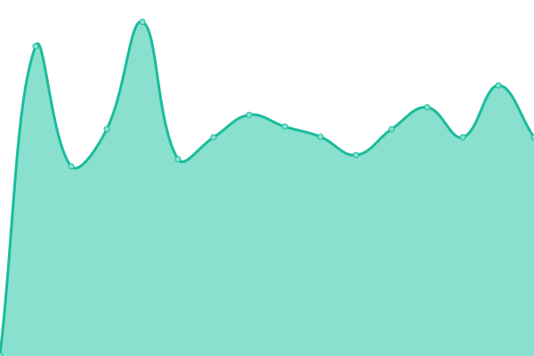
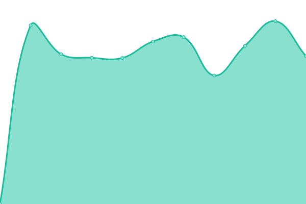
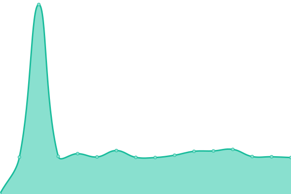
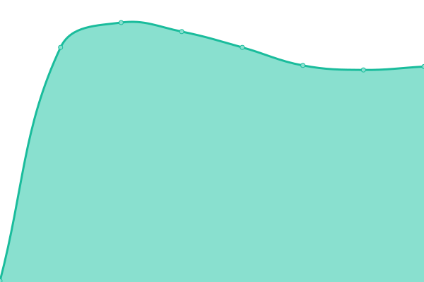
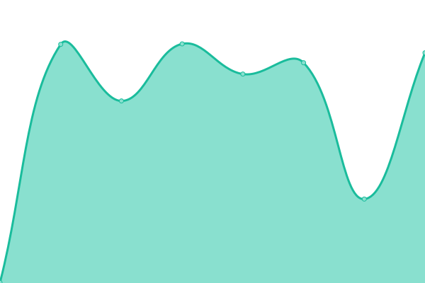
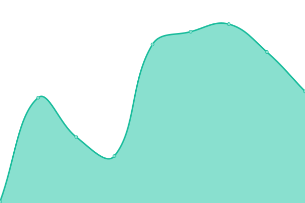
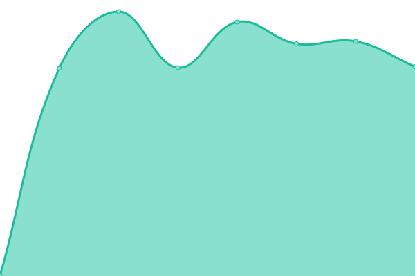

# [📈 Live Status](https://ekoindia.github.io/uptime): <!--live status--> **🟩 All systems operational**

This repository contains the open-source uptime monitor and status page for [Eko India Financial Services Pvt. Ltd.](https://eko.in), powered by [Upptime](https://github.com/upptime/upptime).

With [Upptime](https://upptime.js.org), you can get your own unlimited and free uptime monitor and status page, powered entirely by a GitHub repository. We use [Issues](https://github.com/ekoindia/uptime/issues) as incident reports, [Actions](https://github.com/ekoindia/uptime/actions) as uptime monitors, and [Pages](https://ekoindia.github.io/uptime) for the status page.

<!--start: status pages-->
<!-- This summary is generated by Upptime (https://github.com/upptime/upptime) -->
<!-- Do not edit this manually, your changes will be overwritten -->
<!-- prettier-ignore -->
| URL | Status | History | Response Time | Uptime |
| --- | ------ | ------- | ------------- | ------ |
|  [Eloka Webapp](https://ekostore.app) | 🟩 Up | [eloka-webapp.yml](https://github.com/ekoindia/uptime/commits/HEAD/history/eloka-webapp.yml) | 

 535ms
     
 | 

<a href="https://ekoindia.github.io/uptime/history/eloka-webapp">99.40%</a>
    

|  Eloka API | 🟩 Up | [eloka-api.yml](https://github.com/ekoindia/uptime/commits/HEAD/history/eloka-api.yml) | 

 1149ms
     
 | 

<a href="https://ekoindia.github.io/uptime/history/eloka-api">100.00%</a>
    

|  [Connect Webapp](https://connect.eko.in) | 🟩 Up | [connect-webapp.yml](https://github.com/ekoindia/uptime/commits/HEAD/history/connect-webapp.yml) | 

 1153ms
     
 | 

<a href="https://ekoindia.github.io/uptime/history/connect-webapp">100.00%</a>
    

|  Connect Eloka Widget | 🟩 Up | [connect-eloka-widget.yml](https://github.com/ekoindia/uptime/commits/HEAD/history/connect-eloka-widget.yml) | 

 1904ms
     
 | 

<a href="https://ekoindia.github.io/uptime/history/connect-eloka-widget">100.00%</a>
    

|  AePS Gateway | 🟩 Up | [aeps-gateway.yml](https://github.com/ekoindia/uptime/commits/HEAD/history/aeps-gateway.yml) | 

 1113ms
     
 | 

<a href="https://ekoindia.github.io/uptime/history/aeps-gateway">100.00%</a>
    

|  Axis - Payout | 🟩 Up | [axis-payout.yml](https://github.com/ekoindia/uptime/commits/HEAD/history/axis-payout.yml) | 

 1147ms
     
 | 

<a href="https://ekoindia.github.io/uptime/history/axis-payout">99.84%</a>
    

|  Castler - Virtual Account | 🟩 Up | [castler-virtual-account.yml](https://github.com/ekoindia/uptime/commits/HEAD/history/castler-virtual-account.yml) | 

 270ms
     
 | 

<a href="https://ekoindia.github.io/uptime/history/castler-virtual-account">99.74%</a>
    

|  Fingpay - AePS | 🟩 Up | [fingpay-aeps.yml](https://github.com/ekoindia/uptime/commits/HEAD/history/fingpay-aeps.yml) | 

 275ms
     
 | 

<a href="https://ekoindia.github.io/uptime/history/fingpay-aeps">100.00%</a>
    

|  Fino - AePS | 🟩 Up | [fino-aeps.yml](https://github.com/ekoindia/uptime/commits/HEAD/history/fino-aeps.yml) | 

 275ms
     
 | 

<a href="https://ekoindia.github.io/uptime/history/fino-aeps">100.00%</a>
    

|  Razorpay - Payout | 🟩 Up | [razorpay-payout.yml](https://github.com/ekoindia/uptime/commits/HEAD/history/razorpay-payout.yml) | 

 275ms
     
 | 

<a href="https://ekoindia.github.io/uptime/history/razorpay-payout">100.00%</a>
    

|  Signzy - Sign Document | 🟩 Up | [signzy-sign-document.yml](https://github.com/ekoindia/uptime/commits/HEAD/history/signzy-sign-document.yml) | 

 278ms
     
 | 

<a href="https://ekoindia.github.io/uptime/history/signzy-sign-document">100.00%</a>
    

|  Zoho | 🟩 Up | [zoho.yml](https://github.com/ekoindia/uptime/commits/HEAD/history/zoho.yml) | 

 363ms
     
 | 

<a href="https://ekoindia.github.io/uptime/history/zoho">99.46%</a>
    

|  [Eko Website](https://eko.in) | 🟩 Up | [eko-website.yml](https://github.com/ekoindia/uptime/commits/HEAD/history/eko-website.yml) | 

 373ms
     
 | 

<a href="https://ekoindia.github.io/uptime/history/eko-website">100.00%</a>
    

|  [Guides+SOP Portal](https://ekoindia.github.io/empages/) | 🟩 Up | [guides-portal.yml](https://github.com/ekoindia/uptime/commits/HEAD/history/guides-portal.yml) | 

 125ms
     
 | 

<a href="https://ekoindia.github.io/uptime/history/guides-portal">100.00%</a>
    

|  Automaton | 🟩 Up | [automaton.yml](https://github.com/ekoindia/uptime/commits/HEAD/history/automaton.yml) | 

 868ms
     
 | 

<a href="https://ekoindia.github.io/uptime/history/automaton">100.00%</a>
    

|  Lint | 🟩 Up | [lint.yml](https://github.com/ekoindia/uptime/commits/HEAD/history/lint.yml) | 

 927ms
     
 | 

<a href="https://ekoindia.github.io/uptime/history/lint">100.00%</a>
    

<!--end: status pages-->

[**Visit our status website →**](https://ekoindia.github.io/uptime)

## 📄 License

- Powered by: [Upptime](https://github.com/upptime/upptime)
- Code: [MIT](./LICENSE) © [Anand Chowdhary](https://anandchowdhary.com), supported by [Pabio](https://pabio.com)
- Data in the `./history` directory: [Open Database License](https://opendatacommons.org/licenses/odbl/1-0/)
